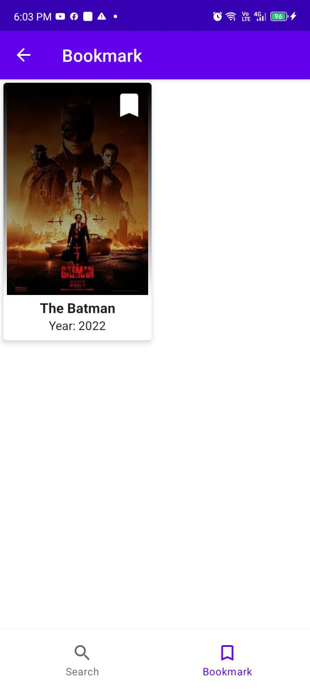

# MovieSearchApp (Paging 3 => PagingSource)

"Search for movies by title, explore detailed information about each film, and easily bookmark your favorites for quick access later."

## App design and architecture
Project is based on MVVM architecture,  written in Kotlin using Android Jetpack components and libraries.
App implements "Single Activity - multiple Fragments" navigation pattern.

## Movie Data:
The app uses PagingSource to efficiently fetch paginated movie data from a remote API. This allows for smooth and scalable loading of movies as the user scrolls through the list.

## Bookmarking:
For bookmarking movies, the app uses Room Database to locally store and manage user-selected favorites. This ensures that users can bookmark movies and access their list of favorites offline.

Android Jetpack Architecture Components used:
- Kotlin
- Paging 3
- ViewModel
- LiveData
- Retrieve Network Data from API (REST API)
- ViewBinding
- Navigation component

Dependency injection:
- Dagger-Hilt

Kotlin libraries:
- Kotlin Coroutines

## Credits
[OMDB RESTful API](https://www.omdbapi.com/)

Project uses third-party libraries:
- [Paging 3](https://developer.android.com/topic/libraries/architecture/paging/v3-overview) for loading and display pages of data .
- [Retrofit](https://github.com/square/retrofit) for making RESTful API calls
- [Dagger-Hilt](https://developer.android.com/training/dependency-injection/hilt-android) dependency injection
- [Glide](https://github.com/bumptech/glide) image loading library
- [Google-Secrets](https://developers.google.com/maps/documentation/android-sdk/secrets-gradle-plugin) to secure API key

## License
Licensed under the [GNU General Public License v3.0](LICENSE)
